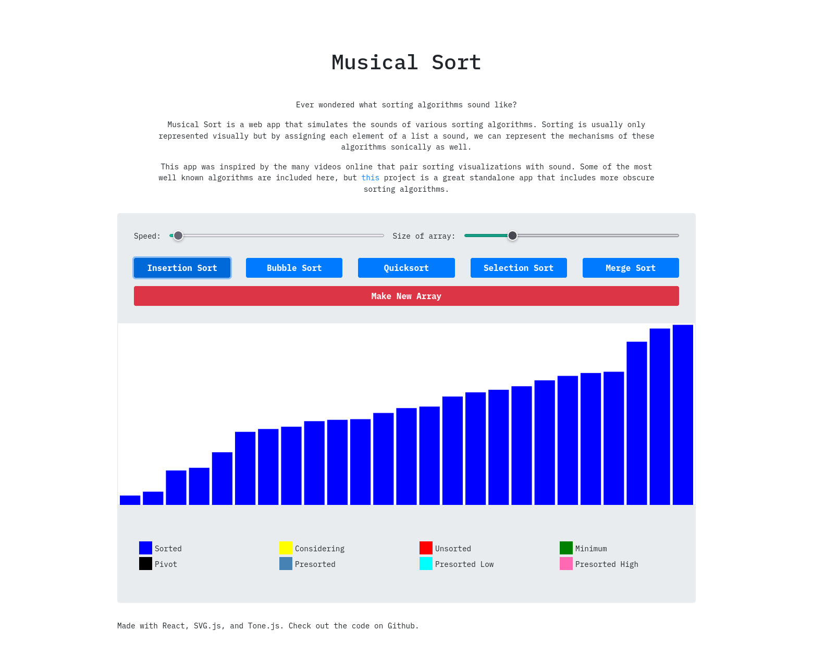

# Musical Sort
A single page React application that both visualizes and creates audio representations of several sorting algorithms.

# Table of Contents
* Motivation
* Technologies
* Installation

# Motivation
There are a many great videos on YouTube that approximate what sorting algorithms would sound like. There is also a very comprehensive standalone desktop app that does the same. This webapp is an attempt to translate that to something that can be run in the browser.

# Technologies
* The entire front-end is written in React
* The sorting algorithms are in Typescript
* The sound is generated using the Tone.js library
